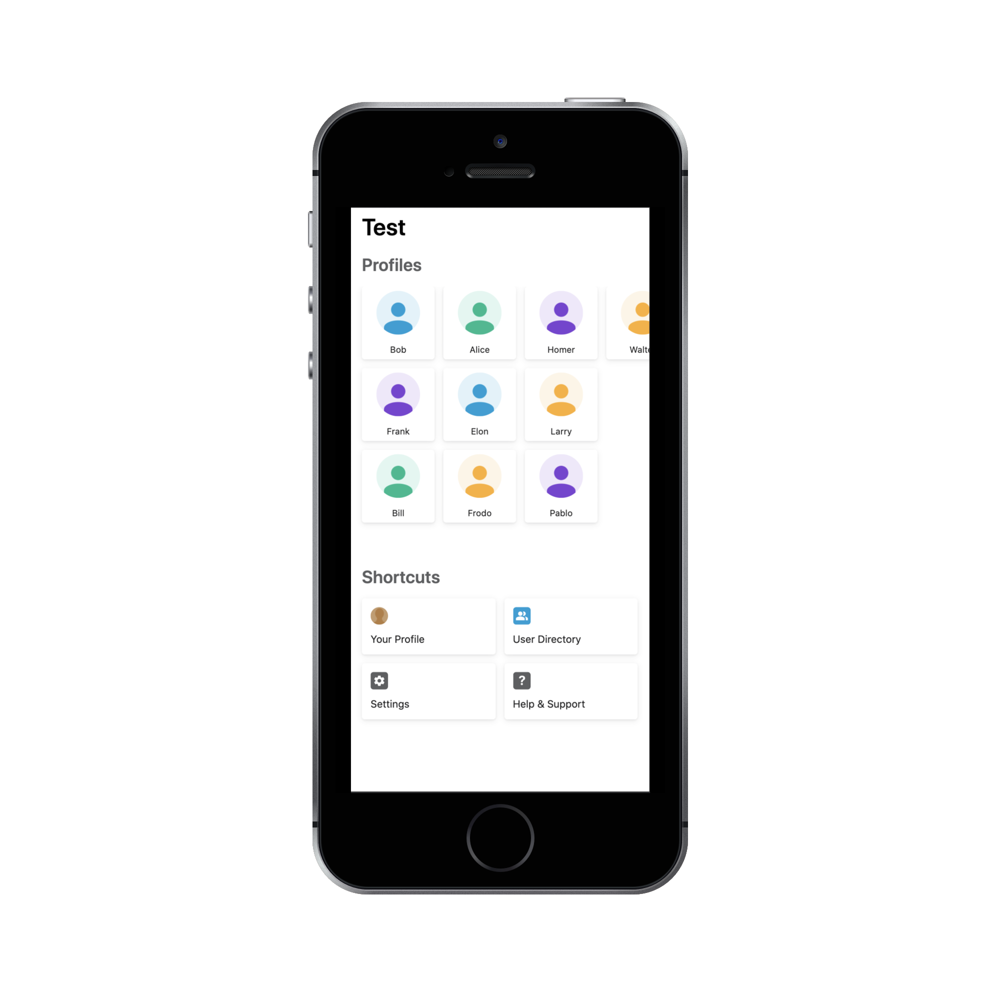

# Home Screen Example Widget - Profiles

A project showcasing home screen widget development by example. The widget uses the Beekeeper JS SDK to fetch 50 user profiles and display them in a grid layout. Please see below image.



For more information regarding the setup and architecture of the home screen, please also see the [developer portal](https://developers.beekeeper.io/v2/welcome/home-screen). 

## Requirements

For widget development, the following dependencies are required:

* [NodeJS](http://nodejs.org/)(>v12)
* [Yarn](https://yarnpkg.com/)

## Get Started 

First, let's install all dependencies by running: 

```sh
yarn
```

Now, we can start the development server: 

```sh
yarn serve
```

In order to use your local widget in a tenant, it is required to make it accessible from the outside world. One way is to use [NGROK](https://ngrok.com/) to expose your local development. Next, you will need to make a request to the API to register the widget type and grant access for your tenant.

## Required Steps for Widget Development

The following four steps are **required** for every widget to be shown on the home screen.
 
1. [Define Widget ID](src/components/Widget.vue#L19)
    ```javascript:title=home-screen-widget/profiles/src/components/Widget.vue
    export const WIDGET_ID = 'profiles';
    ```
2. [Register Widget Component](src/main.js#L9)
    ```javascript:title=home-screen-widget/profiles/src/main.js
    BeekeeperHomeScreen.registerWidget(WIDGET_ID, component)
    ```
3. [Add widgetInstanceId Prop](src/components/Widget.vue#L38)
    ```javascript:title=home-screen-widget/profiles/src/components/Widget.vue
    props: {
    widgetInstanceId: {
        type: String,
        required: true,
    },
    ```
4. [Trigger LOADED Event](src/components/Widget.vue#L71)
    ```javascript:title=home-screen-widget/profiles/src/components/Widget.vue
    import BeekeeperHomeScreen, { EventType } from '@beekeeper/home-screen-sdk';
    BeekeeperHomeScreen.triggerEvent(EventType.LOADED, this.widgetInstanceId);
    ```

## Registering with API

If you followed above steps, you should have a local development server running on a public accessible URL e.g. http://2af62c7779d5.ngrok.io. Navigating to a sub path of your URL should hold the whole bundle of your widget.

Next, you will have to register your new widget type with the API and configure your Home Screen to include your new widget. For both steps, you can use the provided Python 3 script in the ``scripts`` folder. 

To create a new widget type:

```shell
python3 scripts/configure_home_screen.py --tenantUrl https://<tenant_url> --token <access_token> --op add_widget_type --widgetType <widget_type> --widgetUrl <widget_url>
```

To grant access to your widget for all users of a tenant: 

```shell
python3 scripts/configure_home_screen.py --tenantUrl https://<tenant_url> --token <access_token> --op add_widget --tenantAccess <tenant_id> --widgetType <widget_type>
```

## Caveats with Webpack

As the Home Screen uses Webpack to bundle components, please take a look at [vue.config.js](./vue.config.js) to understand the mandatory configuration.

## Limitations

The home screen only supports widgets developed using [Vue 2](https://vuejs.org/) and [Vuex 3](https://vuex.vuejs.org/). 
If you are new to Vue, please visit the [official guide](https://vuejs.org/v2/guide/).
